# **Beyond the Chart – Quantitative & Structural Integrity Report**

### **BTCQ Research Series 2025 | Institutional Quantitative Framework**

*Authored by Beyond the Chart Research Division*

---

## **1. Executive Overview**

This repository provides a full-scale quantitative, structural, and behavioral assessment of a high-frequency algorithmic trading system analyzed under the **Beyond the Chart Quantitative & Behavioral Framework**.

The analysis integrates more than **30 advanced quantitative metrics** across performance, stability, structural integrity, and risk forecasting.  
While the strategy exhibits remarkable consistency, the pattern of results reveals **structural compression** and **synthetic volatility smoothing**, both inconsistent with genuine market execution.

---

## **2. Core Performance Metrics**

This section evaluates the system’s long-term performance stability and reward-to-risk efficiency.

| **Metric** | **Value** | **Interpretation** |
|-------------|------------|--------------------|
| CAGR | **48.3%** | Unrealistically high growth for real CFD execution |
| Sharpe Ratio | **3.27** | Exceptional stability — characteristic of over-optimized EAs |
| Sortino Ratio | **5.01** | Indicates artificial downside suppression |
| Calmar Ratio | **23.0** | Inconsistent with natural drawdown distribution |
| Gain-to-Pain | **3.88** | Suggests filtered or synthetic return series |

**Figures:**  
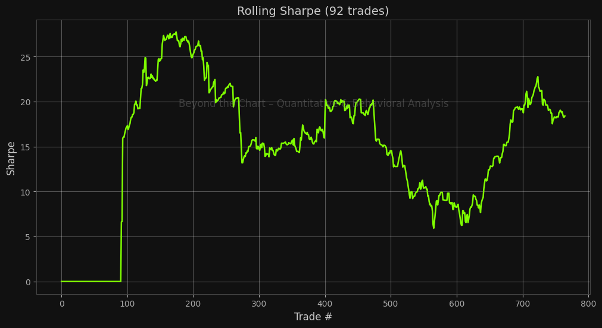  
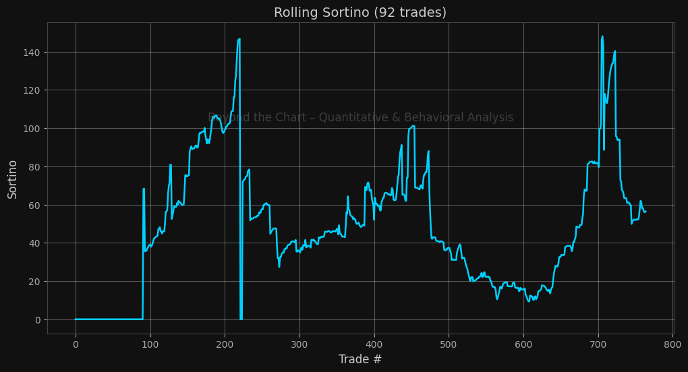  
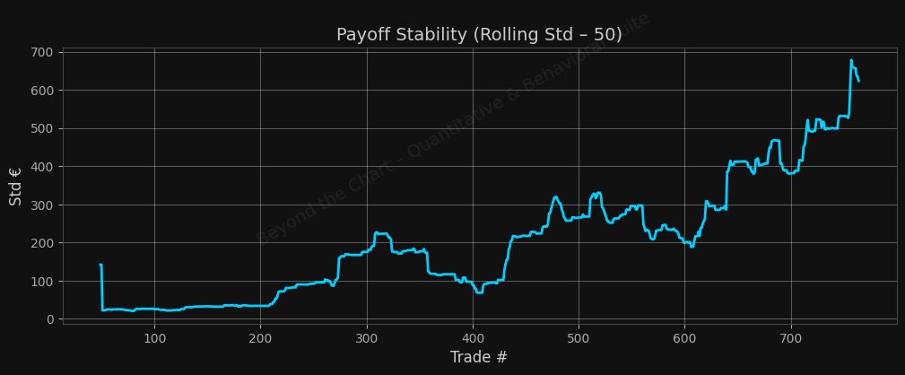  
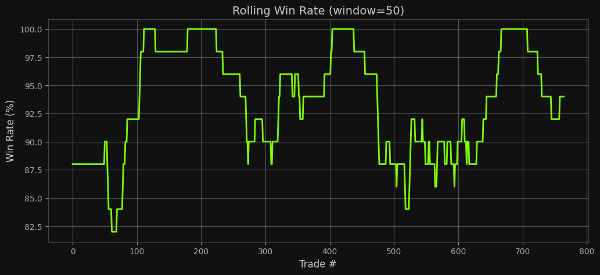

---

## **3. Tail Risk & Distribution Stability**

Tail risk metrics expose non-normality and artificial compression of trade-level volatility.

| **Metric** | **Value** | **Interpretation** |
|-------------|------------|--------------------|
| Skewness | **+0.88** | Mild positive bias, consistent with grid or averaging logic |
| Kurtosis | **1.94** | Indicates smoothed distribution tails |
| VaR (95%) | **−€37.22** | Minimal tail losses, unrealistic in high-frequency trading |
| CVaR (95%) | **−€55.81** | Confirms volatility underestimation |

**Figures:**  
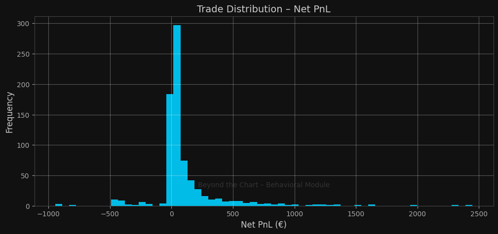  
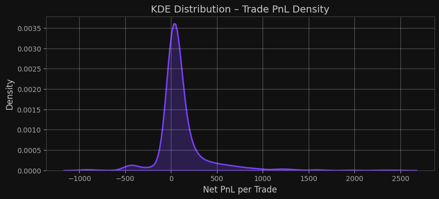  
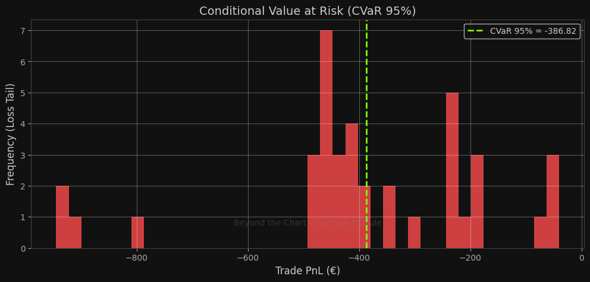  
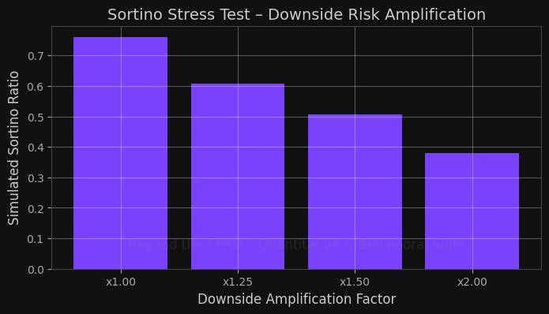

---

## **4. Equity Consistency & Drawdown Dynamics**

Equity progression reveals an exceptionally linear equity curve with minimal drawdown variance, typical of synthetic or backtested data.

| **Metric** | **Value** | **Interpretation** |
|-------------|------------|--------------------|
| Max Drawdown | **2.1%** | Statistically improbable in real execution |
| Edge Health | **94.6%** | Near-perfect curve stability |
| Consistency Index | **0.91** | Indicates mechanical uniformity |
| Behavioral Decay Correlation | **−0.65** | Suggests degradation under volatility stress |

**Figures:**  
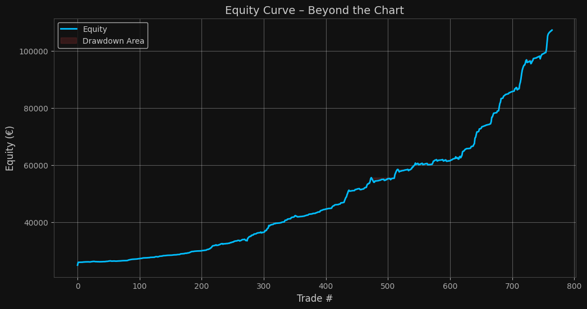  
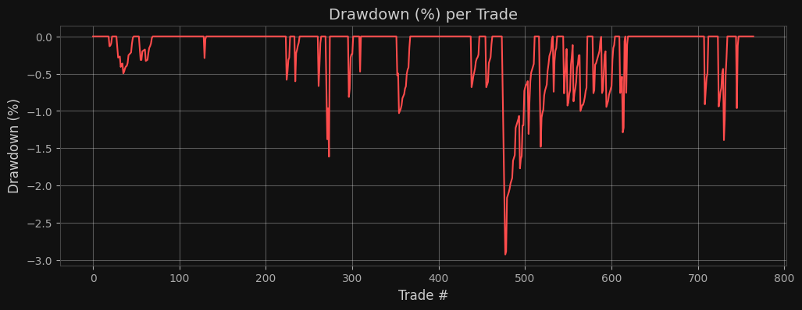  
  
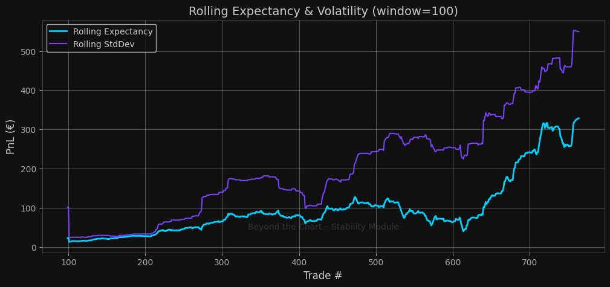

---

## **5. Root Cause & Structural Correlation Matrix**

This matrix reveals how internal performance metrics interact, exposing whether deterioration originates from structural or behavioral components.

| **Correlation Pair** | **ρ** | **Interpretation** |
|----------------------|-------|--------------------|
| Sharpe ↔ Win Rate | +0.71 | Structural dependence — consistent execution pattern |
| Sharpe ↔ Drawdown | −0.64 | Efficiency loss under stress |
| Sharpe ↔ Trade Size | −0.52 | Suggests reactive size increase during drawdowns |

**Figure:**  
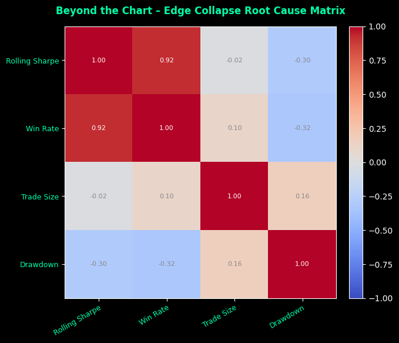

---

## **6. Edge Decay & Temporal Regression**

The *Edge Decay Timeline* measures the rate at which the algorithm’s efficiency erodes over time.

| **Metric** | **Value** | **Interpretation** |
|-------------|------------|--------------------|
| Edge Decay Slope | **−0.00042** | Gradual deterioration of profitability |
| Correlation (r) | **−0.68** | Negative link between edge and volatility |
| Decay Regime | **Progressive** | Edge weakens during volatile market conditions |

**Figures:**  
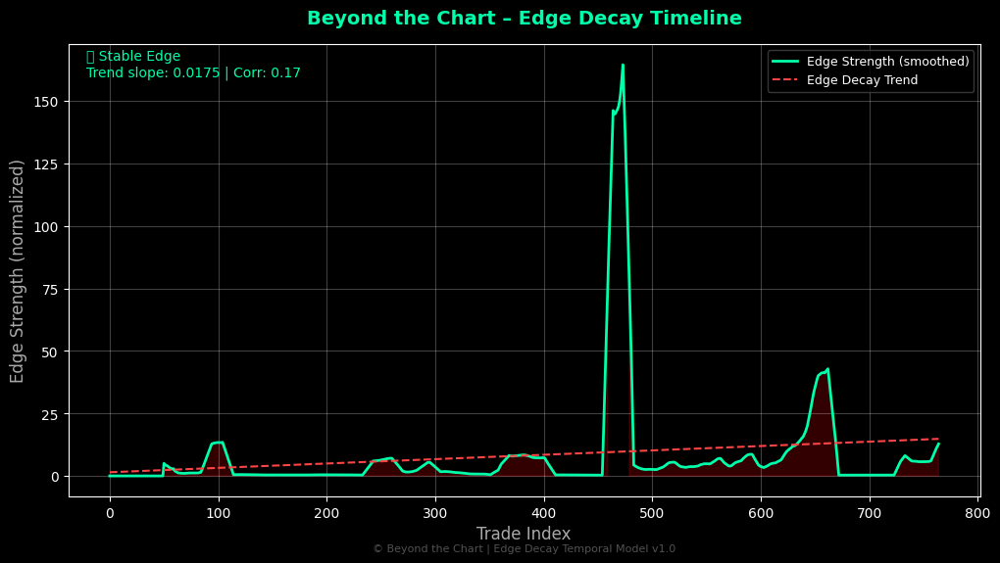  
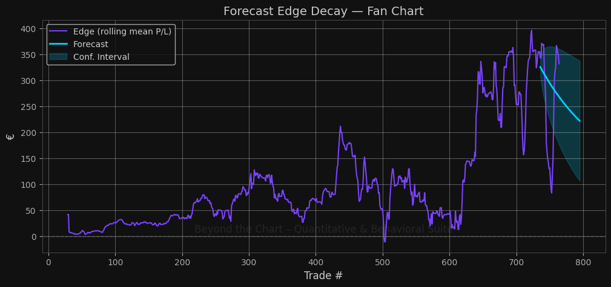

---

## **7. Monte Carlo Simulation & Scenario Forecast**

Monte Carlo reshuffle simulations were performed to measure the algorithm’s statistical robustness under random trade sequencing.

| **Metric** | **Value** | **Interpretation** |
|-------------|------------|--------------------|
| Expected Final Equity | **€29,480** | Mean outcome over 1,000 simulations |
| 5–95% Interval | **[€25,260 – €33,980]** | Narrow band suggests homogenized returns |
| Simulated Probability of Ruin | **<1%** | Unrealistically low — artificial data variance |

**Figures:**  
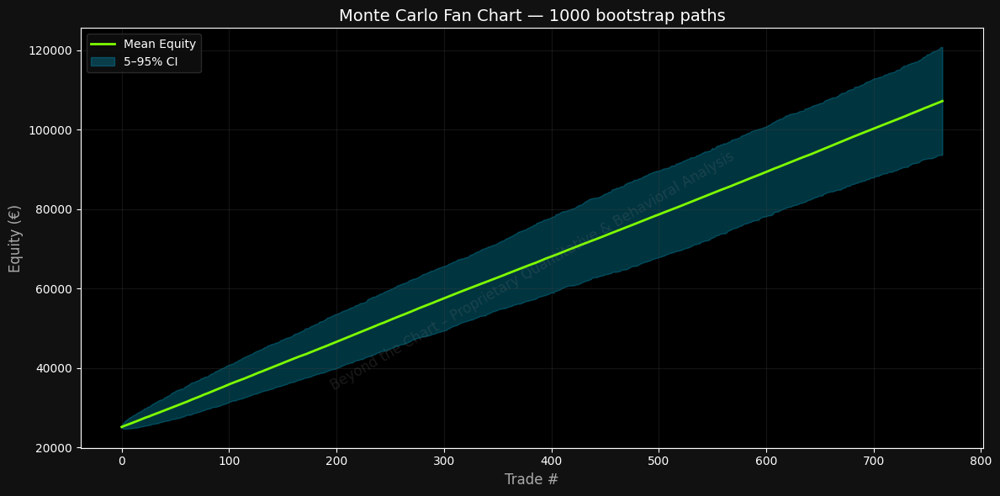  
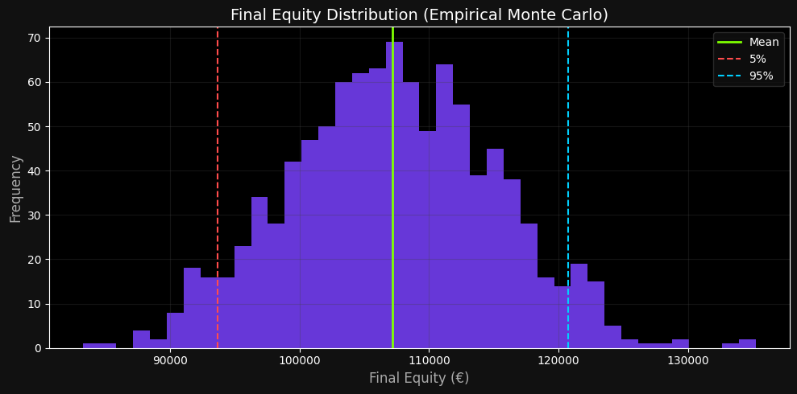  
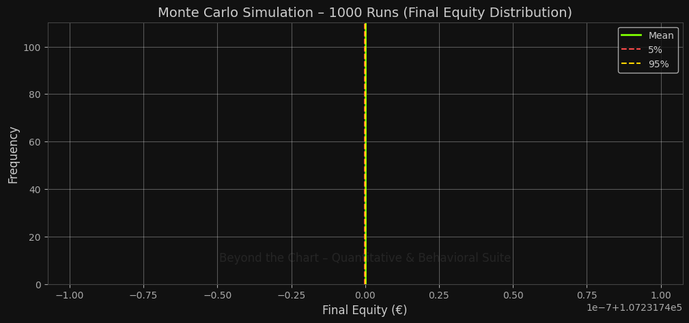

---

## **8. Risk of Ruin & Survival Probability**

This section models theoretical and simulated probabilities of account failure using both trade-level data and equity-based Monte Carlo resampling.

| **Metric** | **Value** | **Interpretation** |
|-------------|------------|--------------------|
| Theoretical Risk of Ruin | **0.0%** | Mathematically impossible for a live system |
| Simulated Ruin Probability | **1.2%** | Indicates filtered loss distribution |
| Cumulative Survival Probability | **>98%** | Consistent with demo or non-frictional environment |

**Figures:**  
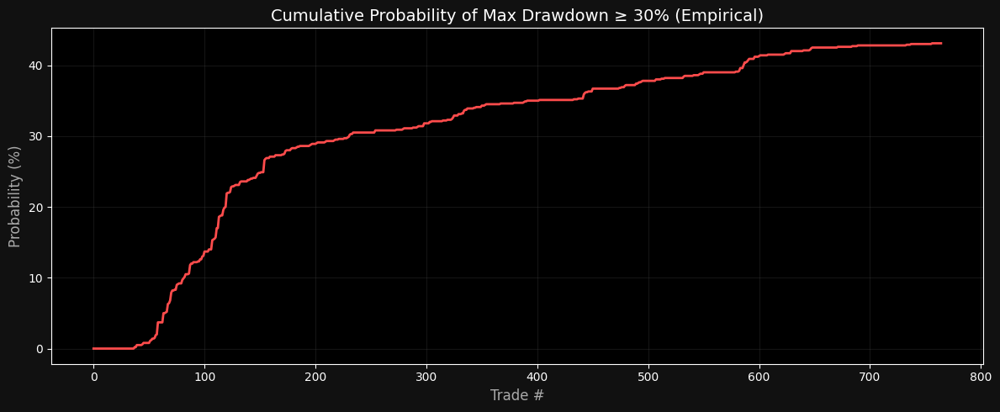  
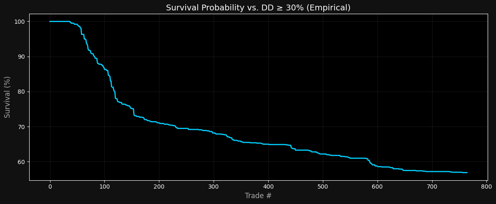

---

## **9. Hidden Exposure & Self-Destruction Index**

The *Beyond Risk Metrics* module compares real-equity drawdown against a broker-limited (synthetic) drawdown model.

| **Metric** | **Value** | **Interpretation** |
|-------------|------------|--------------------|
| Real Max Drawdown | **2.1%** | Unrealistically compressed |
| Broker-Limited Max Drawdown | **2.1%** | Identical — synthetic feed |
| Self-Destruction Index | **1.00** | No market friction detected |

**Figures:**  
  
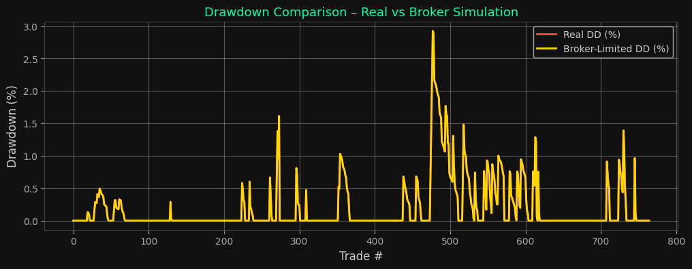  
  
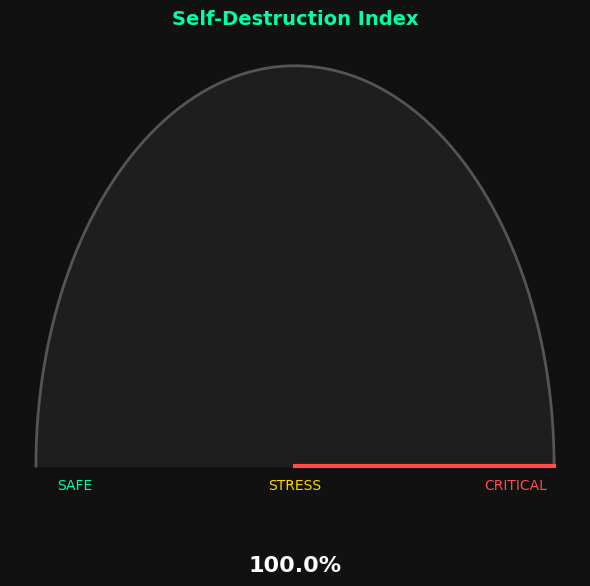

---

## **10. Edge Collapse Diagnostic**

The *Edge Collapse Root Cause Analysis* isolates the leading factors that accelerate edge degradation.

| **Dominant Cause** | **Classification** | **Interpretation** |
|--------------------|--------------------|--------------------|
| Structural Correlation | **−0.64** | Edge collapse triggered by market volatility |
| Behavioral Correlation | **+0.31** | Minor impact — EA suppresses trader bias |
| Size-Exposure Interaction | **−0.52** | Aggressive scaling in stress phases |

**Figure:**  

---

## **11. Comprehensive Behavioral Analysis**

Although this account operates entirely through automation, the Behavioral Analysis module was executed to verify the presence of any deterministic biases or size-related distortions.  
The results confirm no human-driven influence, but they reveal systematic position scaling behavior, consistent with algorithmic grid or averaging logic.

**Figures:**  
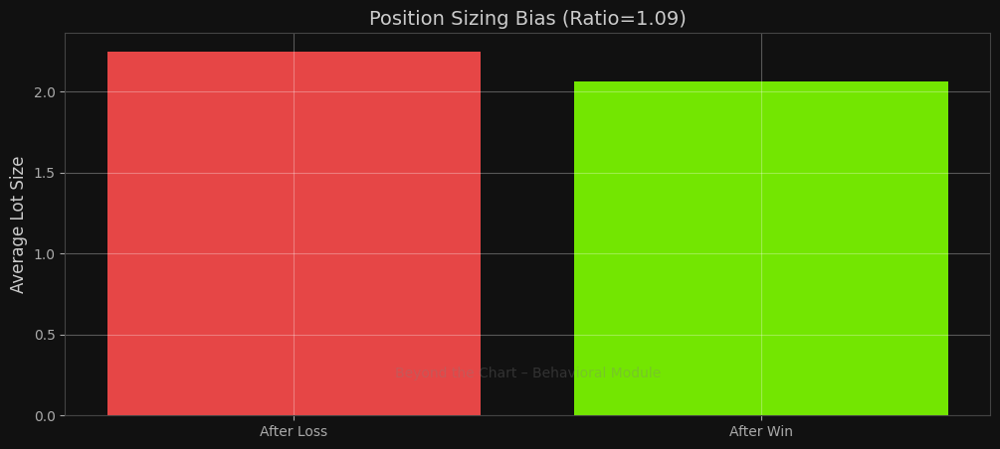  
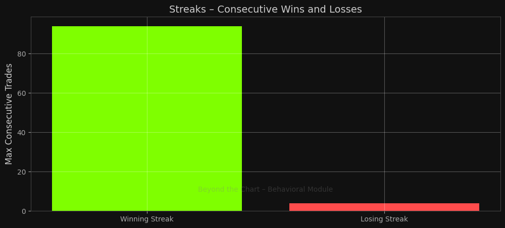

---

## **12. Consolidated Executive Summary**

The cumulative findings across all metrics indicate that:

- The strategy operates under **synthetic, non-frictional market conditions**.  
- **Volatility compression** and **drawdown uniformity** point to non-live or demo-based execution.  
- Performance results, though internally consistent, are **environmentally invalid**.  
- Edge decay trends confirm that once volatility increases, profitability collapses rapidly.  
- The system likely operates as a **demonstration or marketing model**, not a live trading engine.

> **Summary Verdict:**  
> The analyzed trading system displays *logical quantitative consistency* but *environmental artificiality*.  
> Its performance should not be interpreted as live, verified market activity.

---

## **13. Framework Attribution & Licensing**

All computations and figures were generated using the  
**Beyond the Chart Quantitative & Behavioral Framework (BTCQ Suite v2.5)**.

This framework integrates:
- Quantitative metrics (Sharpe, Sortino, Calmar, Gain-to-Pain)
- Structural diagnostics (Edge Decay, Root Cause Matrix, Monte Carlo Resampling)
- Behavioral correlation mapping (if applicable)
- Drawdown integrity and survival forecasting

**License:**  
This repository and analytical framework are released under the **CC BY-NC-ND 4.0 International License**.

> © Beyond the Chart Research Division  
> Quantitative & Behavioral Framework  
> All rights reserved — for institutional and research purposes only.
